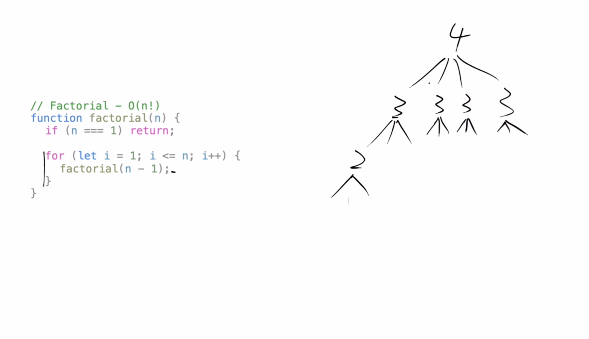

## Common Math Operations

### Constant
Constant (O(1)) complexity means that the algorithm takes roughly the same number of steps for any size input. In a constant time algorithm there is no relationship between the size of the input and the number of steps required.
```math
f(n) = y
```
### Logarithmic
 Logarithmic complexity algorithms will typically have a sense of continually "halving" the size of the input. Another tell of a Logarithmic algorithm is that we don't have to touch every element of the input. O(log2(n)) means that every time we double the size of the input, we only require one additional step.

```math
f(n) = log(n)
```

### Linear
Linear complexity algorithms will touch each element of the input "once" (in the Big-O sense). Algorithms that iterate through the input without nested loops or recurse by reducing the size of the input by "one" each time are typically Linear. Classic Example: Checking if an element exists in an Array.

```math
f(n) = ngim1
```

### Log-Linear
This complexity class is common in recursive sorting algorithms such as mergeSort and quickSort. This class is a combination of both linear and logarithmic behavior, so features from both classes are evident. Typically, this means that the recursive calls will halve the input each time (logarithmic), but iterations are also performed (linear). Classic Example: Merge Sort Algorithm.


```math
f(n) = n * log(n)
```


Pic from App academy open.

### Polynomial
Polynomial complexity refers to complexity of the form O(nc) where n is the size of the input and c is some fixed constant. For example, O(n3) is a larger/worse function than O(n2), but they belong to the same complexity family. Nested loops are usually the indicator of this complexity class. Classic Examples: Generate all pairs of elements in an array (n2). Generate all triplets of elements in an array (n3).

```math
f(n) = n^c

```


Quadratic - polynomial
```math
f(n) = n^2
```

Cubic - polynomial
```math
f(n) = n^3
```

### Exponential
Exponential complexity refers to functions of the form O(cn) where n is the size of the input and c is some fixed constant. For example, O(3n) is a larger/worse function than O(2n), but they both belong to the same complexity family. A common indicator of this complexity class is recursive code where there is a `constant number of recursive calls in each stack frame`. The c will be the number of recursive calls made in each stack frame. Algorithms with this complexity are considered quite slow. Classic Example: Generate all subsets/combinations of elements in an array (O(2n)). In subsets/combinations, the order does not matter.


Exponential

#### `n is in the exponent part`


```math
f(n) = c^n
```

Examples:

```math
f(n) = 2^n
```
In n^2, we always branch twice

```math
f(n) = 3^n
```
In n^3 , we always branch thrice.


### Polynomial vs Exponential
#### `Polynomial is better than exponential`
Any exponential function is better than any polynomial function as n grows to infinity

```math
n^2  < 2^n
```

| n |  Polynomial| Exponential |
| :---: | :---: | :---: |
| n |  n^2| 2^n |
| 0 | 0 | 1 |
| 1 | 1 | 2 |
| 2 | 4 | 6 |
| 3 | 9 | 12 |
| 4 | 16 | 24 |
| 5 | 25 | 48 |
| 6 | 36 | 96 |

### Factorial

Even worse than the exponential and polynomial

Recall that n! = (n) * (n - 1) * (n - 2) * ... * 1. This complexity is typically the largest/worst we will end up implementing. A typical indicator of this complexity class is recursive code that has a variable number of recursive calls in each stack frame. Note that Factorial is worse than Exponential because Factorial algorithms have a variable amount of recursive calls in each frame, whereas Exponential algorithms have a constant amount in each frame. Classic Example: Generate all permutations of elements in an array. In permutations, the order does matter.


```math
!n = n * (n-1) * (n-2) ... * 1
```
Example
```math
!4 = 4 * 3 * 2 * 1 = 24
```
The number of times we branch is tied to our input


In the example, we branch
four times to four 3s
three times to twelve 2s
two times to twenty four 1s
### Exponential vs Factorial
In exponential functions, the number of times we branch is constant whereas in factorial, the number of branch keeps on changing.

# Measure of scale of performance - BIG O
We should focus on how the performance of our algorithm is effected by the increasing size of the input. In other words, how does our performance scale ?


[Read more here on app academy](https://open.appacademy.io/learn/full-stack-online/data-structures-and-algorithms/common-complexity-classes-notes)

## Important Rules
1. The function should be defined in terms of the size of the input. We are interested in the behaviour as the input size approaches infinity.
2. A smaller Big-O function is more desirable than a larger one
3. Big-O describes the worst case scenario, also known as the `upper bound`
4. A Big-O function should be simplified to show only it's most dominant mathematical term.
## Space Complexity
Space complexity can involve the space taken up by the inputs to the algorithm. What we reallu refer in coding interviews and when measuring algorithms is `auxiliary space complexity`

### Auxiliay space complexity
Space required by the algorithm, not inluding the space taken up by the inputs.

#### Rules of thumb
* Most primitives (booleans,numbers,undefined,null) data types are constant space
* String require O(n) where n is string length
* Reference types(arrays,objects,map,set) are O(n),where n is the length (for arrays) or the number of keys(objects)


## Simplifying Big-O
### Products
If the function is product of many factors, we drop the factors that don't depend on the size of the input

```math
T(5n^2) => T(5*n^2)=> O(n^2)
```
```math
T(1000n) => T(1000 * n) => O(n)
```
```math
T(42nlogn) => T(42*n*logn)=>O(nlogn)
```

```math
T(12)=> O(1)
```

### Sum
if the function is the sum of many terms, we keep the term with the largest growth rate and drop the other terms.
```math
T(n^3 + n^2 + n^) => O(n^3)
```

```math
T(log(n) + n^2) =>  O(n^2)
```

```math
T(n + log(n)) => O(n)
```

```math
T(n! + 10n) => O(n!)
```


# Algorithms
## Recursion
Solving a Problem Recursively:
Because every recursive problem must have a base and recursive case, we can follow these steps to help us write a recursive method:

1. Identify the base case in the problem and code it. The base case should explicity handle the scenario(s) where the arguments are so trivially "small", that we immediately know the result without further calculation. Be sure it works by testing it.
2. Solve the next level of the problem, using the result of the base case. Test it.
3. Modify the code in step 2, generalizing it for every level of the problem.

### When is recursion appropriate?
Recursion allows us to solve problems in an elegant way. However, recursion is a tool that is only appropriate for certain problems. Look to the struture of a problem to figure out if it can be solved recursively. 
Recursion is used to solve problems that can be decomposed into smaller versions of the same problem. 
For example we can decompose fib(n) into fib(n - 1) + fib(n - 2). Intuitively, we know that fib(n - 1) is a "smaller" or "easier" problem than fib(n). The easiest subproblem is fib(1) or fib(2) because the answer is simply 1; this is an assumption in the fibonacci sequence. We use the easiest subproblems as the base case in recursion.
