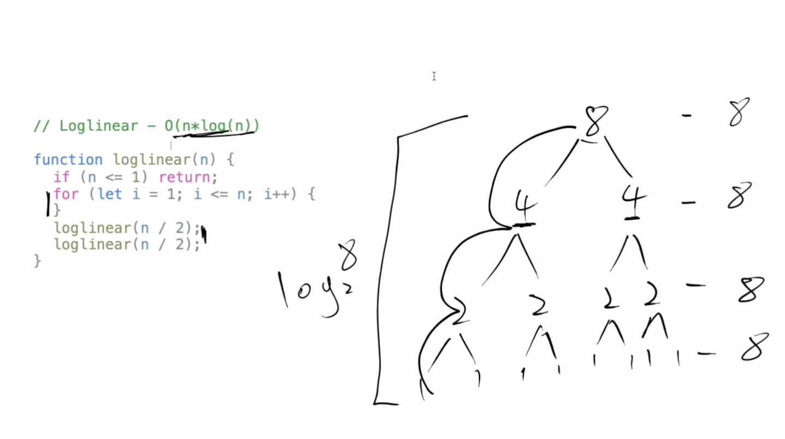
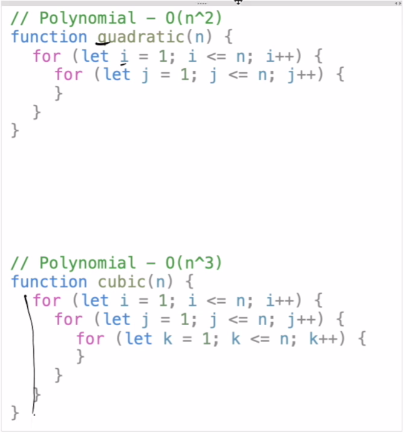
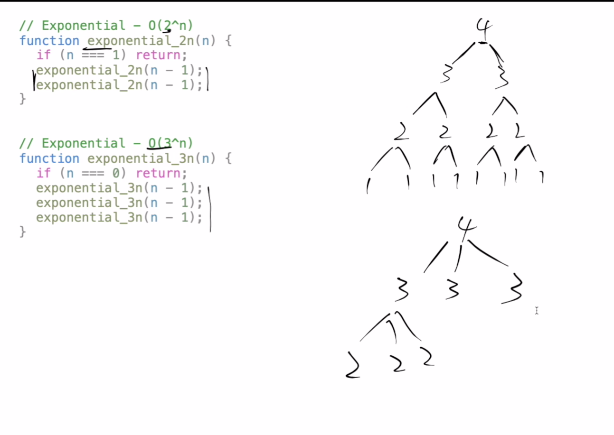

## Common Math Operations

Constant
```math
f(n) = y
```
Logarithmic
```math
f(n) = log(n)
```

Linear

```math
f(n) = ngim1
```

### Log-Linear
```math
f(n) = n * log(n)
```


Pic from App academy open.

### Polynomial

```math
f(n) = n^c

```


Quadratic - polynomial
```math
f(n) = n^2
```

Cubic - polynomial
```math
f(n) = n^3
```

### Exponential
Exponential

#### `n is in the exponent part`


```math
f(n) = c^n
```

Examples:

```math
f(n) = 2^n
```

```math
f(n) = 3^n
```



### Polynomial vs Exponential
#### `Polynomial is better than exponential`
Any exponential function is better than any polynomial function as n grows to infinity

```math
n^2  < 2^n
```

| n |  Polynomial| Exponential |
| :---: | :---: | :---: |
| n |  n^2| 2^n |
| 0 | 0 | 1 |
| 1 | 1 | 2 |
| 2 | 4 | 6 |
| 3 | 9 | 12 |
| 4 | 16 | 24 |
| 5 | 25 | 48 |
| 6 | 36 | 96 |

### Factorial

Even worse than the exponential and polynomial
```math
!n = n * (n-1) * (n-2) ... * 1
```

!4 = 4 * 3 * 2 * 1

# Measure of scale of performance - BIG O
We should focus on how the performance of our algorithm is effected by the increasing size of the input. In other words, how does our performance scale ?

## Important Rules
1. The function should be defined in terms of the size of the input. We are interested in the behaviour as the input size approaches infinity.
2. A smaller Big-O function is more desirable than a larger one
3. Big-O describes the worst case scenario, also known as the `upper bound`
4. A Big-O function should be simplified to show only it's most dominant mathematical term.
## Space Complexity
Space complexity can involve the space taken up by the inputs to the algorithm. What we reallu refer in coding interviews and when measuring algorithms is `auxiliary space complexity`

### Auxiliay space complexity
Space required by the algorithm, not inluding the space taken up by the inputs.

#### Rules of thumb
* Most primitives (booleans,numbers,undefined,null) data types are constant space
* String require O(n) where n is string length
* Reference types(arrays,objects,map,set) are O(n),where n is the length (for arrays) or the number of keys(objects)


## Simplifying Big-O
### Products
If the function is product of many factors, we drop the factors that don't depend on the size of the input

```math
T(5n^2) => T(5*n^2)=> O(n^2)
```
```math
T(1000n) => T(1000 * n) => O(n)
```
```math
T(42nlogn) => T(42*n*logn)=>O(nlogn)
```

```math
T(12)=> O(1)
```

### Sum
if the function is the sum of many terms, we keep the term with the largest growth rate and drop the other terms.
```math
T(n^3 + n^2 + n^) => O(n^3)
```

```math
T(log(n) + n^2) =>  O(n^2)
```

```math
T(n + log(n)) => O(n)
```

```math
T(n! + 10n) => O(n!)
```
